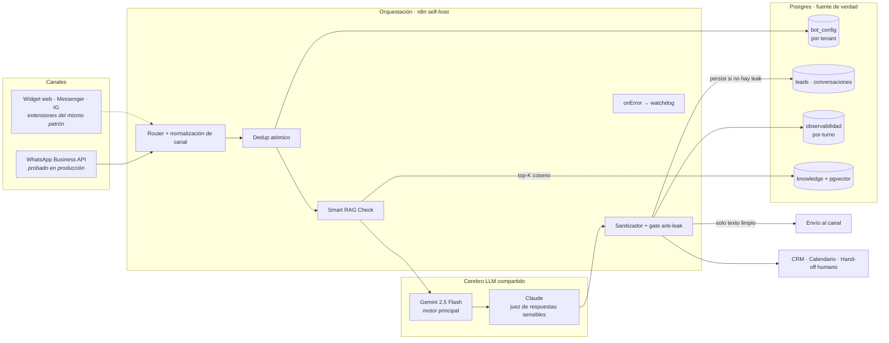

# neuralab-agent-showcase

**Arquitectura de referencia de un agente conversacional IA multi-tenant con RAG,
omnicanal-ready y hardening determinista.**

> Showcase técnico de ingeniería. Ilustra cómo construimos agentes conversacionales
> en producción. No incluye credenciales, datos de clientes ni lógica de negocio real:
> todos los ejemplos son genéricos y autocontenidos.

[](./LICENSE)
[](#nota-sobre-este-repositorio)
[](#stack-y-por-qué-cada-capa)

---

## Qué es

Este repositorio documenta la arquitectura con la que Neuralab construye agentes
conversacionales IA: un **cerebro LLM compartido** que atiende a **múltiples
clientes (multi-tenant)**, responde anclado en una **base de conocimiento (RAG)**
para no alucinar, y protege cada respuesta con una **capa de sanitización
determinista** antes de que llegue al usuario.

Es lo mismo que corremos en producción, reducido a ejemplos limpios que un
ingeniero puede leer, entender y evaluar. Si estás evaluando a quién le confiás un
proyecto de agente omnicanal con RAG y CRM, este repo es nuestra carta técnica.

**Lo que vas a encontrar:**
- Un [esquema SQL](./sql/schema.sql) del modelo de datos multi-tenant con `pgvector`.
- Un [workflow n8n de ejemplo](./examples/workflow-inbound.example.json) con el flujo completo inbound → respuesta.
- El [patrón de sanitización post-LLM](./examples/sanitize-output.js) y el [Smart RAG Check](./examples/smart-rag-check.js) en JavaScript comentado.
- Documentación técnica del [flujo de un mensaje](./docs/arquitectura.md) y del [modelo multi-tenant](./docs/multi-tenant.md).

---

## Diagrama de arquitectura



---

## Stack y por qué cada capa

| Capa | Tecnología | Por qué |
|---|---|---|
| **Cerebro (motor)** | Gemini 2.5 Flash | Económico, baja latencia y contexto largo — ideal para el grueso del tráfico conversacional. |
| **Cerebro (juez)** | Claude (Anthropic) | Segunda opinión determinística sobre respuestas sensibles, donde el costo extra se justifica. |
| **Orquestación** | n8n (self-host) | Router, integraciones y crons. **No es el cerebro**: orquesta webhooks, canales, CRM y DB alrededor del LLM. |
| **RAG** | PostgreSQL + pgvector + embeddings | Retrieval por similitud coseno en la misma base que el resto de los datos: menos piezas móviles, aislamiento por tenant, anti-alucinación. |
| **Persistencia / memoria** | PostgreSQL | Fuente única de verdad: config, leads, conversaciones, conocimiento y observabilidad por-turno. |
| **Embeddings** | text-embedding (OpenAI) | Embeddings de calidad para el índice de conocimiento (dimensión configurable en el schema). |

**Decisión de diseño clave:** el LLM nunca es el sistema, es un componente del
sistema. Toda su entrada y su salida pasan por código determinista y verificable.

---

## Características

### Multi-tenant real
Un cerebro compartido atiende N clientes; el ruteo es por `bot_id` y la config vive
en la tabla `bot_config`. Onboarding de un cliente nuevo = `INSERT` de config +
carga de su base de conocimiento, **no un fork de workflows**. Aislamiento de datos
por tenant en cada query (y RLS recomendado en producción).
→ [docs/multi-tenant.md](./docs/multi-tenant.md)

### RAG anti-alucinación
Chunks + embeddings en `pgvector`, retrieval top-K acotado por coseno, respuesta
**anclada estrictamente a lo recuperado**. El patrón **Smart RAG Check** saltea el
retrieval en etapas avanzadas de la conversación para no inflar el contexto ni el
costo de tokens. → [examples/smart-rag-check.js](./examples/smart-rag-check.js)

### Hardening determinista (nuestro diferenciador)
- **Sanitización post-LLM:** el LLM propone, un filtro de código valida y limpia la
  salida antes de enviarla. El modelo nunca habla directo al usuario.
- **Gate anti-leak:** las respuestas marcadas como sospechosas **no se persisten** en
  el historial — corta bucles de contaminación del contexto.
- **Dedup atómico:** `INSERT ... ON CONFLICT DO UPDATE ... RETURNING` para distinguir
  mensaje nuevo de repetido sin condiciones de carrera.
- **`onError` → watchdog:** los fallos alertan a un canal interno; nada falla en silencio.
- **Aislamiento de credenciales:** tokens por referencia a vault, nunca en el workflow.
→ [examples/sanitize-output.js](./examples/sanitize-output.js) · [docs/arquitectura.md](./docs/arquitectura.md)

### Omnicanal-ready
El router normaliza el canal de entrada (texto/audio/imagen) y despacha al mismo
cerebro. **WhatsApp Business API (Meta Cloud) es el canal probado en producción.**
El mismo patrón de router se extiende a Messenger, Instagram y widget web como
extensiones — mismo pipeline, distinto adaptador de canal.

### Hand-off a humano
Cuando el agente detecta que debe transferir (pedido explícito del usuario, caso
fuera de alcance, señal de compra), dispara una notificación a un asesor humano y
marca el lead como derivado.

### Observabilidad por-turno
Cada turno registra input, output, modelo, etapa conversacional, uso de RAG, tokens
y latencia en una tabla dedicada. Depurar el comportamiento del agente y controlar
el costo es cuestión de una consulta SQL.

---

## Estructura del repo

```
neuralab-agent-showcase/
├── README.md                              Este archivo
├── LICENSE                                MIT
├── CONTRIBUTING.md                        Naturaleza del repo y contacto
├── .gitignore
├── docs/
│   ├── arquitectura.md                    Flujo de un mensaje, paso a paso + diagrama de secuencia
│   └── multi-tenant.md                    Modelo un-cerebro-N-clientes, aislamiento y onboarding
├── sql/
│   └── schema.sql                         DDL genérico: bot_config, leads, conversaciones, knowledge, observabilidad
└── examples/
    ├── workflow-inbound.example.json      Workflow n8n mínimo (inbound → router → RAG → LLM → sanitize → send)
    ├── sanitize-output.js                 Sanitización determinista post-LLM + detección de leak
    └── smart-rag-check.js                 Decisión de consultar RAG según etapa de la conversación
```

---

## Cómo se despliega (guía genérica)

> Pasos de referencia para levantar una arquitectura de este tipo. Los ejemplos del
> repo son ilustrativos: no es un producto listo para `docker compose up`.

1. **Base de datos.** PostgreSQL 14+ con la extensión `pgvector`. Aplicar
   [`sql/schema.sql`](./sql/schema.sql) para crear las tablas y el índice vectorial
   HNSW. Habilitar Row-Level Security por `bot_id` para aislamiento en profundidad.

2. **Orquestador.** n8n self-host (Docker). Importar
   [`examples/workflow-inbound.example.json`](./examples/workflow-inbound.example.json)
   como referencia del flujo y reemplazar los placeholders de credenciales
   (`{{ POSTGRES_CREDENTIAL }}`, `{{ VECTOR_DB_CREDENTIAL }}`, `{{ LLM_API_CREDENTIAL }}`)
   por credenciales reales gestionadas en el vault de n8n.

3. **Modelos.** Configurar el acceso al motor principal (Gemini 2.5 Flash), al juez
   (Claude) y al proveedor de embeddings. Las keys viven en el vault, nunca en el
   workflow.

4. **Conocimiento.** Chunkear los documentos de cada tenant, generar embeddings e
   insertarlos en `knowledge` con su `bot_id`.

5. **Canal.** Conectar el webhook del canal (WhatsApp Business API u otro) al nodo
   de entrada del router.

6. **Alta de tenants.** Un `INSERT` en `bot_config` por cliente. El mismo pipeline
   los atiende a todos.

7. **Escala.** Los workers de n8n escalan horizontalmente para procesar ejecuciones
   en paralelo; Postgres es la fuente de verdad compartida.

Capacidad de referencia de una implementación de este tipo: del orden de decenas de
workflows, workers escalados horizontalmente y decenas de ejecuciones concurrentes.

---

## Nota sobre este repositorio

Es un **showcase de arquitectura**, no un producto empaquetado. Deliberadamente **no
contiene**: credenciales, tokens, connection strings, datos de clientes, nombres de
clientes, system prompts reales ni IDs de workflows/webhooks de producción. Todos
los identificadores son ficticios y todos los ejemplos son genéricos.

Tampoco publicamos métricas de resultados comerciales de clientes: lo que este repo
demuestra son **capacidades técnicas y decisiones de ingeniería** verificables leyendo
el código y los diagramas.

Construido por **Neuralab** — [neuralab.marketing](https://neuralab.marketing) ·
Licencia [MIT](./LICENSE).
