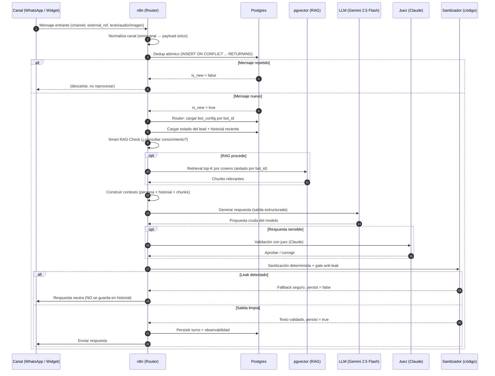

# Arquitectura — flujo de un mensaje

Este documento describe, paso a paso, el ciclo de vida de un mensaje entrante en
el agente conversacional, desde que llega al webhook hasta que la respuesta sale
al canal. Es la explicación extendida del diagrama del README.

El principio rector es simple: **el LLM propone, el código dispone.** El modelo
nunca escribe directo al usuario ni a la base de datos; siempre hay una capa
determinista entre su salida y el mundo. Eso es lo que hace al sistema auditable,
barato y difícil de romper.

---

## Diagrama de secuencia

---

## Paso a paso

### 1. Entrada y normalización de canal

El webhook recibe el evento del canal. Cada canal (WhatsApp Business API, widget
web, etc.) tiene un formato distinto; el router lo **normaliza** a un payload
único con los campos que el resto del flujo espera: `bot_id`, `channel`,
`external_ref` (identificador opaco del contacto), y el contenido del mensaje
(texto, o transcripción de audio / descripción de imagen). A partir de acá, el
resto del pipeline es idéntico sin importar de qué canal vino.

### 2. Dedup atómico

Las APIs de mensajería reintentan entregas: el mismo mensaje puede llegar dos o
tres veces. Un `INSERT ... ON CONFLICT DO UPDATE ... RETURNING (xmax = 0) AS is_new`
resuelve en **una sola operación atómica** si el mensaje es nuevo o repetido, sin
condiciones de carrera entre workers concurrentes. Si es repetido, se descarta
ahí mismo: no se reprocesa ni se le cobra al cliente un turno de LLM de más.

### 3. Router multi-tenant

Con el `bot_id` se carga la fila de `bot_config` correspondiente: persona
(system prompt), modelo, flags de RAG e integraciones habilitadas. **UN workflow
atiende N clientes**; el comportamiento cambia por dato, no por código. (Detalle
en [multi-tenant.md](./multi-tenant.md).)

### 4. Carga de estado e historial

Se recuperan el estado del lead (etapa del funnel, campos ya capturados) y los
últimos turnos de la conversación. Esta es la memoria que le da coherencia al
diálogo entre turnos.

### 5. Smart RAG Check

Antes de tocar la base de conocimiento, una función determinista decide **si vale
la pena consultarla en este turno**. En etapas tempranas (el lead pregunta qué se
ofrece, precios, cómo funciona) el conocimiento de dominio es clave. En etapas
avanzadas (agendar, confirmar datos, hand-off) el contexto ya vive en el historial
y consultar RAG solo agregaría tokens y latencia. Ver
[`examples/smart-rag-check.js`](../examples/smart-rag-check.js).

### 6. Retrieval RAG (cuando procede)

Se calcula el embedding de la consulta y se recuperan los **top-K chunks** más
cercanos por distancia coseno sobre `pgvector`, filtrando por `bot_id`. K es
acotado (típicamente 3–5) para no inflar el contexto. La respuesta del agente se
**ancla estrictamente a estos chunks**: si el conocimiento no está en lo
recuperado, el agente no lo inventa (anti-alucinación).

### 7. Construcción del contexto

Se ensambla el prompt final: persona del tenant + historial relevante + chunks
recuperados + el mensaje del usuario, bajo un contrato de salida estructurada
(el modelo debe responder un JSON `{ reply, action }`).

### 8. LLM (motor principal)

**Gemini 2.5 Flash** genera la propuesta de respuesta: económico, baja latencia y
contexto largo, ideal para el grueso del tráfico conversacional. La salida es una
**propuesta cruda**, no la respuesta final.

### 9. Validación con juez (respuestas sensibles)

Para respuestas de mayor riesgo (compromisos, información delicada, casos que el
tenant marca como sensibles), una capa de validación con **Claude** actúa de juez:
revisa la propuesta del motor principal y la aprueba o corrige antes de continuar.
No todo turno pasa por el juez — se reserva para donde el costo se justifica.

### 10. Sanitización determinista + gate anti-leak

El paso que hace al sistema robusto. Un filtro de código:

- **Parsea** la salida del modelo contra el contrato esperado (JSON `{reply, action}`),
  degradando con gracia si vino texto plano.
- **Valida** que la acción esté en un conjunto cerrado permitido.
- **Detecta leaks**: marcadores de que el modelo filtró su prompt interno,
  andamiaje, o credenciales.
- **Limpia** el texto (roles residuales, longitud, espacios).
- Ante cualquier anomalía, entrega un **fallback seguro** en vez de la salida cruda.

Ver [`examples/sanitize-output.js`](../examples/sanitize-output.js).

### 11. Persistencia con gate anti-leak

Solo se persiste en el historial lo que pasó el filtro. Una respuesta marcada como
sospechosa (`leak = true`) **no se guarda**: así se corta el bucle de contaminación
donde una salida envenenada se convierte en contexto del turno siguiente. En
paralelo se escribe la fila de **observabilidad por-turno** (modelo, etapa, uso de
RAG, tokens, latencia, flag de leak) para depuración y control de costos.

### 12. Envío al canal

Se envía **únicamente el texto sanitizado**. Si la `action` lo indica, se disparan
las integraciones: alta/actualización de lead en el CRM, agendamiento en el
calendario, o notificación de **hand-off** a un asesor humano.

---

## Hardening — resumen de los diferenciadores

| Mecanismo | Qué previene |
|---|---|
| Sanitización determinista post-LLM | Que el modelo hable directo al usuario; salidas malformadas o con leaks |
| Gate anti-leak (no persistir sospechosas) | Bucles de contaminación del contexto turno a turno |
| Dedup atómico `ON CONFLICT ... RETURNING` | Reprocesar mensajes duplicados / cobrar tokens de más |
| Smart RAG Check | Inflar el contexto y el costo con retrieval innecesario |
| Aislamiento de credenciales (referencias a vault) | Exponer tokens/keys en el workflow |
| `onError` → watchdog a canal interno | Fallos silenciosos en producción |
| Anclaje estricto a chunks recuperados | Alucinación de datos fuera de la base de conocimiento |

Cada uno es una línea de defensa independiente. Ninguno depende de que el modelo
"se porte bien".
