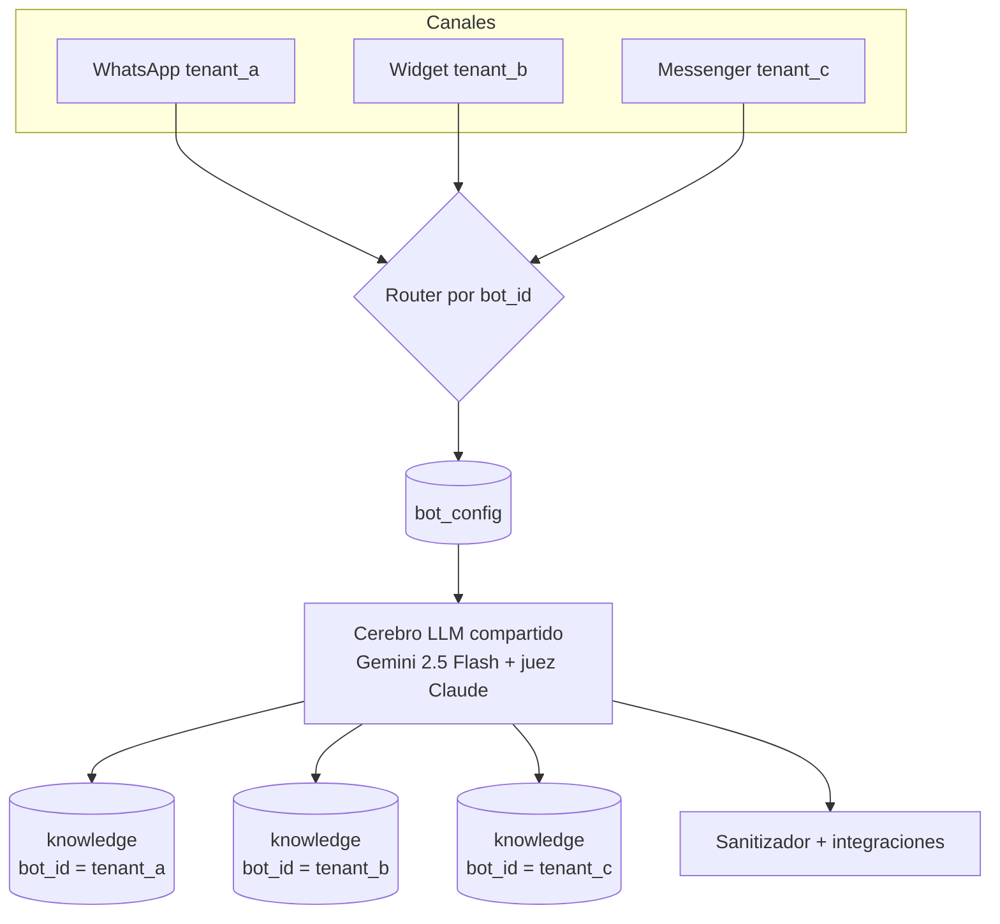

# Multi-tenant — un cerebro, N clientes

El sistema está diseñado alrededor de una idea central: **un solo cerebro
compartido atiende a muchos clientes (tenants)**. No hay un workflow por cliente
ni un modelo por cliente. Hay un pipeline, y el comportamiento se resuelve por
datos en tiempo de ejecución según el `bot_id`.

Esto es lo que hace al sistema económico de operar y rápido de escalar: sumar un
cliente nuevo es un `INSERT`, no un fork.

---

## El modelo



Un mismo cerebro procesa el tráfico de todos los tenants. Lo que cambia entre uno
y otro vive en datos:

- **Persona y reglas** → columna `system_prompt` de `bot_config`.
- **Modelo y parámetros** → `llm_model`, `rag_top_k`, etc.
- **Integraciones activas** → `integrations` (CRM, calendario, hand-off, canales).
- **Conocimiento** → filas de `knowledge` con ese `bot_id`.
- **Datos operativos** (leads, conversaciones, observabilidad) → siempre etiquetados
  con `bot_id`.

---

## Aislamiento de datos

Cada tabla de datos lleva `bot_id` y **toda consulta filtra por él**. Un tenant
nunca ve leads, conversaciones ni conocimiento de otro:

```sql
-- Retrieval de conocimiento: SIEMPRE acotado al tenant
SELECT chunk, source
FROM knowledge
WHERE bot_id = $1              -- aislamiento por tenant
ORDER BY embedding <=> $2
LIMIT $3;
```

Para defensa en profundidad, en un despliegue productivo se recomienda además
**Row-Level Security (RLS)** de Postgres por `bot_id`, de modo que el aislamiento
no dependa solo de que cada query recuerde incluir el filtro, sino que lo imponga
el motor de base de datos.

El aislamiento de credenciales es parte del mismo principio: los tokens de cada
integración se guardan por referencia a un vault de credenciales, nunca embebidos
en el workflow ni en `bot_config`.

---

## Onboarding de un cliente nuevo

Dar de alta un tenant **no toca el pipeline**. El flujo es:

1. **INSERT en `bot_config`** con la persona (system prompt), el modelo, los flags
   de RAG e integraciones y los horarios del nuevo cliente.
2. **Cargar la base de conocimiento**: se chunkean los documentos del cliente
   (FAQ, catálogo, políticas), se generan sus embeddings y se insertan en
   `knowledge` con el `bot_id` nuevo.
3. **Conectar el canal**: apuntar el webhook del canal (ej. WhatsApp Business API)
   al router y registrar las credenciales en el vault.
4. **Listo.** El mismo cerebro ya atiende al cliente nuevo. Cero cambios de código,
   cero despliegue, cero riesgo de regresión sobre los tenants existentes.

```sql
-- Alta de un tenant nuevo (ejemplo genérico)
INSERT INTO bot_config (bot_id, display_name, system_prompt, integrations, business_hours)
VALUES (
  'tenant_d',
  'Asistente de Acme',
  'Sos el asistente de Acme. Respondé con precisión y derivá a un asesor cuando el usuario pida hablar con una persona...',
  '{"crm": true, "calendar": true, "handoff": true, "channels": ["whatsapp"]}'::jsonb,
  '{"mon_fri": "09:00-18:00", "sat": "10:00-13:00"}'::jsonb
);
```

---

## Por qué importa

| Enfoque | Sumar un cliente | Riesgo sobre los demás | Costo operativo |
|---|---|---|---|
| Un workflow por cliente | Duplicar y editar el flujo | Alto (drift entre copias) | Crece lineal, mantenimiento N× |
| **Un cerebro, N tenants (este)** | `INSERT` de config + conocimiento | Nulo (mismo código para todos) | Amortizado; un fix beneficia a todos |

Un cambio de arquitectura o una mejora de hardening se hace **una vez** y aplica a
todos los tenants a la vez. Un bug se arregla **una vez**. Y como el pipeline es
único, la observabilidad, los tests y el hardening se concentran en un solo lugar
en lugar de dispersarse en decenas de copias divergentes.
